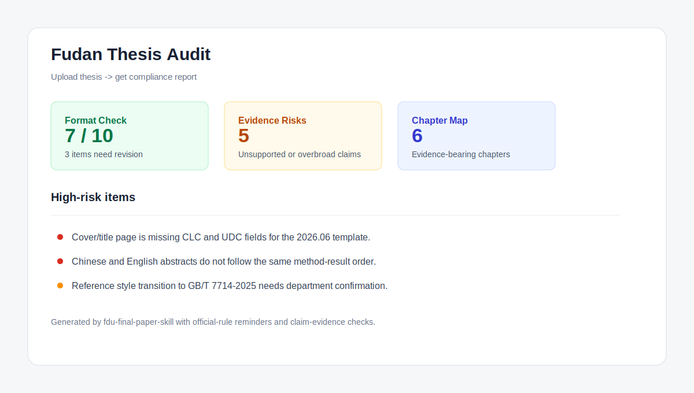
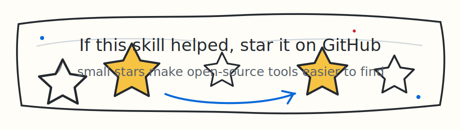

# Fudan Graduate Thesis Skill

English | [简体中文](README.zh-CN.md)

Current skill version: `v0.1.1`. See [`CHANGELOG.md`](CHANGELOG.md) for release notes.

Upload thesis -> get compliance report. Topic -> chapter plan. Draft -> claim-evidence audit.

`fdu-final-paper-skill` is a Codex skill for Fudan master's and doctoral theses. It helps an agent turn messy thesis material into a defensible chapter plan, revise Chinese/English academic prose, check claim-evidence alignment, and audit the thesis against Fudan's 2026.06 thesis specification by default, while allowing newer or department-specific compliance links, files, folders, and templates to override or supplement that baseline.



## Why Use It

- **Topic -> chapter plan**: turn a research topic, methods, data, and degree type into a chapter tree with evidence requirements.
- **Draft -> claim-evidence audit**: catch inflated contribution claims, unsupported conclusions, inconsistent terminology, and missing figure/table interpretation.
- **Upload thesis -> compliance report**: check front matter, abstracts, figure/table lists, references, notes, conclusions, appendices, and defense-readiness risks against the default Fudan 2026.06 baseline or user-supplied compliance sources.
- **LaTeX/BibTeX ready**: run Fudan-friendly compile diagnostics for `fduthesis`, output directories, and PDF artifact verification; reuse the optional LaTeX helper bundle for broader paper workflows.
- **DOCX friendly without vendoring risk**: use your installed document/DOCX plugin or skill for Word editing; this repository does not redistribute unclear-license DOCX code.

## One-Minute Install

Start with an agent that supports skills, such as Codex or Claude Code.

Then choose one install path:

1. Use the agent's built-in skill installer if it has one. Give it this GitHub repository and ask it to install `fdu-final-paper-skill`.
2. Or install by hand: clone this repository, then copy only `skills/fdu-final-paper-skill` into the agent's local `skills` folder.

Bash/macOS/Linux:

```bash
git clone https://github.com/XuTianle0101/fDu-Paper-Skill.git
cd fDu-Paper-Skill
mkdir -p "${CODEX_HOME:-$HOME/.codex}/skills"
cp -R skills/fdu-final-paper-skill "${CODEX_HOME:-$HOME/.codex}/skills/"
```

PowerShell/Windows:

```powershell
git clone https://github.com/XuTianle0101/fDu-Paper-Skill.git
cd fDu-Paper-Skill
$target = if ($env:CODEX_HOME) { "$env:CODEX_HOME\skills" } else { "$HOME\.codex\skills" }
New-Item -ItemType Directory -Force -Path $target | Out-Null
Copy-Item -Recurse -Force .\skills\fdu-final-paper-skill $target
```

Restart the agent after installing, then try a prompt like:

```text
Use $fdu-final-paper-skill to audit my thesis outline for Fudan 2026 compliance.
```

Optional checkout validation for maintainers:

```bash
python scripts/quick_validate.py skills/fdu-final-paper-skill
python scripts/smoke_test.py
```

## Updating an Installed Skill

Installed Codex skills are copied into the local skills directory, so users who installed an earlier version should update their repository checkout and reinstall the skill folder.

```bash
git pull

rm -rf "${CODEX_HOME:-$HOME/.codex}/skills/fdu-final-paper-skill"
cp -R skills/fdu-final-paper-skill "${CODEX_HOME:-$HOME/.codex}/skills/"
```

PowerShell:

```powershell
git pull

$skills = if ($env:CODEX_HOME) { "$env:CODEX_HOME\skills" } else { "$HOME\.codex\skills" }
$dest = Join-Path $skills "fdu-final-paper-skill"

Remove-Item -Recurse -Force $dest -ErrorAction SilentlyContinue
Copy-Item -Recurse -Force .\skills\fdu-final-paper-skill $skills
```

Restart Codex after reinstalling so the updated skill is loaded.

If the repository was installed from GitHub and you already have a local checkout:

```bash
cd path/to/fdu-final-paper-skill
git pull
rm -rf "${CODEX_HOME:-$HOME/.codex}/skills/fdu-final-paper-skill"
cp -R skills/fdu-final-paper-skill "${CODEX_HOME:-$HOME/.codex}/skills/"
```

## Release Notifications

Important changes are recorded in [`CHANGELOG.md`](CHANGELOG.md). Maintainers should publish GitHub tags and Releases for user-facing updates, for example `v0.1.0`, `v0.1.1`, and `v0.2.0`.

Users who want update notifications can open the GitHub repository, choose **Watch -> Custom -> Releases**, and GitHub will notify them when a new release is published.

## Reading Reference Files Safely

The installed skill includes a reader for Chinese/English PDFs, DOCX files, and text-like references:

```bash
python skills/fdu-final-paper-skill/scripts/read_reference_file.py "path/to/reference.pdf" \
  -o extracted-reference.md
```

If a Chinese path is garbled by the shell, pass it through an environment variable instead:

```powershell
$env:FDU_REF_FILE = "D:\论文资料\参考文献\中文论文.docx"
python skills\fdu-final-paper-skill\scripts\read_reference_file.py --path-env FDU_REF_FILE `
  -o extracted-reference.md
```

Use `--pages 1-5` for long PDFs, `--max-chars 0` for full extraction, and `--list-env` for multiple files.

## Custom Compliance Sources

Fudan 2026.06 remains the default compliance and template reference. You can also give the skill newer Graduate School links, department notices, supervisor instructions, template files, or a folder of rule documents. The agent should read those sources, state which ones were used, and use Fudan 2026.06 only as the default baseline or fallback for missing items.

Example prompt:

```text
Use $fdu-final-paper-skill to audit my thesis.
Default baseline: Fudan 2026.06.
Additional compliance sources:
- Department notice: docs/department-2026-defense-rules.pdf
- Template folder: templates/fudan-school-template/
- Official link: https://example.edu/department/thesis-rules
```

For local rule folders, extract the source set first when needed:

```bash
python skills/fdu-final-paper-skill/scripts/read_reference_file.py \
  --glob "docs/compliance/**/*.pdf" \
  --glob "docs/compliance/**/*.docx" \
  --glob "docs/compliance/**/*.md" \
  -o extracted-compliance-sources.md
```

## Smoother LaTeX Compilation

For `fduthesis` projects, start with the bundled compiler helper instead of hand-rolling wrapper logic:

```bash
python skills/fdu-final-paper-skill/scripts/compile_latex_project.py \
  --project-dir path/to/thesis --main main.tex --engine auto
```

If the project uses a build directory:

```bash
python skills/fdu-final-paper-skill/scripts/compile_latex_project.py \
  --project-dir path/to/thesis --main main.tex --engine auto --output-dir build
```

The helper flags common `fduthesis`/`unicode-math` conflicts such as `amssymb`, prepares `\include` aux subdirectories under the output directory, and verifies the actual fresh PDF path before reporting success or failure.

## Three-Minute Demo

Try these prompts after installing the skill:

```text
Use $fdu-final-paper-skill to design a master's thesis chapter plan.
Topic: 基于多源遥感数据的城市热岛效应时空演化研究
Degree: 学术型硕士
Evidence: Landsat 2013-2023, MODIS LST, POI density, administrative boundary data
Submission batch: 2026-09
```

```text
Use $fdu-final-paper-skill to revise this Chinese abstract and mark claim-evidence risks:
<paste abstract>
```

```text
Use $fdu-final-paper-skill to audit my thesis for Fudan 2026 compliance.
Input files: thesis.pdf, thesis.tex, ref.bib
```

Replay the scripted terminal flow in [`assets/demo.cast`](assets/demo.cast), or read the concrete outputs in [`examples/`](examples/).

## Example Output

```markdown
## Compliance Summary

Status: Needs revision before submission

High-risk items:
- Cover/title page: CLC and UDC fields are missing for the 2026.06 template.
- Chinese and English abstracts: method order is inconsistent with Chapter 3-5.
- References: GB/T 7714 transition must be confirmed for the 2026-09 batch.

Next actions:
1. Download the current official template from Fudan Graduate School.
2. Align abstract claims with verified Chapter 4 tables.
3. Rebuild the figure/table lists after final PDF generation.
```

More examples:

- [`examples/chapter-plan.md`](examples/chapter-plan.md)
- [`examples/abstract-revision.md`](examples/abstract-revision.md)
- [`examples/fudan-2026-compliance-report.md`](examples/fudan-2026-compliance-report.md)
- [`examples/docx-latex-workflow.md`](examples/docx-latex-workflow.md)

## Repository Layout

```text
.
├── skills/fdu-final-paper-skill/       # the installable Codex skill
├── examples/                           # concrete input/output examples
├── evals/                              # 10 realistic eval prompts
├── scripts/                            # repo validation helpers
├── embedded/latex-paper-skills/        # optional MIT-licensed LaTeX helper bundle
├── skills/.../references/              # default Fudan checklist and source policy
├── assets/                             # README screenshot and demo cast
└── .github/workflows/ci.yml            # validation and Fudan spec watch
```

## Fudan Specification Watch

The skill includes a snapshot of the default Fudan Graduate School thesis-spec page and a checker:

```bash
python skills/fdu-final-paper-skill/scripts/check_fudan_spec_update.py \
  --reference skills/fdu-final-paper-skill/references/fudan-2026-format-checklist.md
```

GitHub Actions runs a scheduled check so maintainers can notice when the default official page changes. Custom department links or user-supplied files are evaluated during the user's audit task, not by the scheduled watcher.

## License

MIT for this repository's original content. See [`NOTICE`](NOTICE) for third-party material and attribution.



## Star History

<a href="https://www.star-history.com/#XuTianle0101/fDu-Paper-Skill&Date">
  <picture>
    <source media="(prefers-color-scheme: dark)" srcset="https://api.star-history.com/svg?repos=XuTianle0101/fDu-Paper-Skill&type=Date&theme=dark" />
    <source media="(prefers-color-scheme: light)" srcset="https://api.star-history.com/svg?repos=XuTianle0101/fDu-Paper-Skill&type=Date" />
    
  </picture>
</a>
